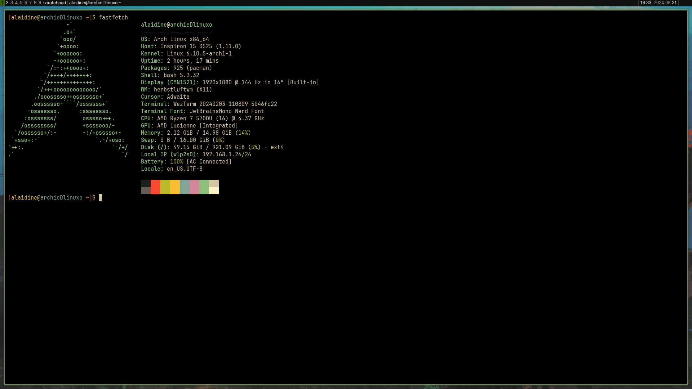

# My Dotfiles



## Introduction

This repository contains my personal dotfiles, which are the customization files that I use to personalize my system. These dotfiles allow me to quickly set up a new machine with my preferred settings and tools.

This setup was inspired by the blog post [Dotfiles: Best way to store in a bare git repository](https://www.atlassian.com/git/tutorials/dotfiles).

## Repository Contents

- `.bashrc`: Customizes the Bash shell environment
- `.bash_aliases`: Customizes the Bash shell aliases
- `.vimrc`: Configuration for the Vim text editor
- `.config/tmux/tmux.conf`: Configuration for the Tmux terminal multiplexer

## Dependencies

Before setting up these dotfiles, ensure you have the following installed:

- git
- vim
- tmux

## Installation Guide

Follow these steps to set up the dotfiles on a new machine:

1. Clone the repository:
   ```
   git clone --bare https://github.com/alaidine/dotfiles.git ~/.dotfiles
   ```

2. Make sure you commited the alias to your .bashrc or .zshrc:
   ```
   alias cfg='/usr/bin/git --git-dir=$HOME/.dotfiles/ --work-tree=$HOME'
   ```

3. Checkout the actual content from the bare repository to your ```home``` directory:
   ```
   cfg checkout
   ```
4. The step above might fail with a message like:
    ```
    error: The following untracked working tree files would be overwritten by checkout:
        .bashrc
        .gitignore
    Please move or remove them before you can switch branches.
    Aborting
    ```
    This is because your ```$HOME``` folder might already have some stock configuration files which would be overwritten by Git. The solution is simple: back up the files if you care about them, remove them if you don't care. I provide you with a possible rough shortcut to move all the offending files automatically to a backup folder:
    ```
    mkdir -p .config-backup && \
    config checkout 2>&1 | egrep "\s+\." | awk {'print $1'} | \
    xargs -I{} mv {} .config-backup/{}
    ```
    Re-run the check out if you had problems:

   ```
   cfg checkout
   ```
5. Set the flag ```showUntrackedFiles``` to ```no``` on this specifi (local) repository:
    ```
    cfg config --local status.showUntrackedFiles no
    ```
6. You're done, from now on you can now type ```cfg``` commands to add and update your dotfiles:
    ```
    config status
    config add .vimrc
    config commit -m "Add vimrc"
    config add .bashrc
    config commit -m "Add bashrc"
    config push
    ```

## Contributing

If you'd like to contribute to these dotfiles, please:

1. Fork the repository
2. Create a new branch for your feature
3. Commit your changes
4. Push to your fork and submit a pull request

## License

This project is licensed under the MIT License.
